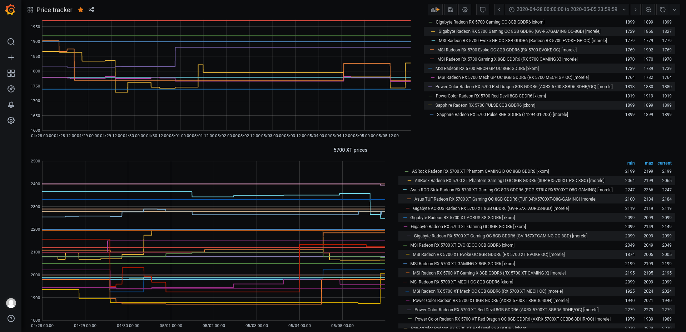

# Price tracker for morele.net and x-kom.pl

Dead simple webscraper in Python utilizing beautifulsoup, with integration to InfluxDB. My first programming project ever.

Install required modules:

```
requests
bs4
influxdb
```

or run:

```
pip install -r requirements.txt
```

## Before you start:

1. First, you need a working instance of InfluxDB for storing data.

2. Modify **config.ini** accordingly.

3. Add links you wish to track to **list.txt**. One link per line.

4. Run: 

   ```
   python3 main.py
   ```


## Example visualization in Grafana:




*Script not tested nor intended for Python 2*